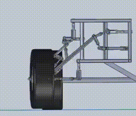

# Kinematic Simulation of Planar, Spherical and Spatial mechanisms
Some practical examples of planar ([ref](https://www.etudes.ru/en/etudes/windscreen-wiper/)), spherical ([ref](http://www.xjishu.com/jx/49002.html)) and spatial ([ref](https://www.markplecnik.com/5-ss-steering-mechanism/)) mechanisms can be seen below.

<p align="middle">



</p>

We use two different gradient based approaches to simulate one degree of freedom closed loop mechanisms. The approach can handle both revolute and prismatic joints.

## Minimizing Cost Function
In first approach, we club all the rigidity constraints into a single cost function. When the system is perturbed due to input, the cost function is minimized to find unknown coordinates. If the cost value does not converge to zero, a feasible solution cannot be found. 

## Newton Rhapson
In this approach, we handle each rigidity constraint seperately as a non-linear polynomial constraint. A jacobian matrix for this system of equation can be found and a numerical solution can be found iteratively using Newton-Rhapson algorithm.

## Examples
### Planar Mechanisms
Two planar mechanisms are simulated. First is the Theo-Jansen walking-robot mechanism which uses an eignt-bar mechanism. The second is Watt's Steam Engine mechanism which brought around the industrial revolution.

<p align="middle">


</p>

### Spherical Mechanisms
Two spherical mechanisms are simulated. The first is a simple four bar mechanism with revolute joints. The second is a six bar Watt-I mechanism with one of the fixed pivots being prismatic.

<p align="middle">


</p>

### Spatial Mechanisms
A spatial 5-SS platform mechanism has been simulated.

<p align="middle">

</p>

# Citation
If you find the code, models, or data useful, please cite this paper:
```
@inproceedings{Sharma2019simulation,
    author = {Sharma, Shashank and Purwar, Anurag},
    title = "{Using a Point-Line-Plane Representation for Unified Simulation of Planar and Spherical Mechanisms}",
    volume = {Volume 5A: 43rd Mechanisms and Robotics Conference},
    series = {ASME International Design Engineering Technical Conferences and Computers and Information in Engineering Conference},
    year = {2019},
    month = {08},
    doi = {10.1115/DETC2019-98194},
    url = {https://doi.org/10.1115/DETC2019-98194},
}
```

